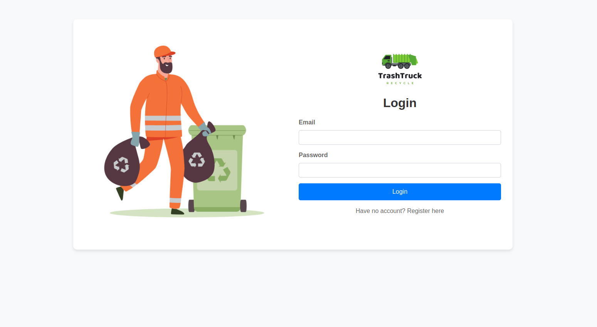
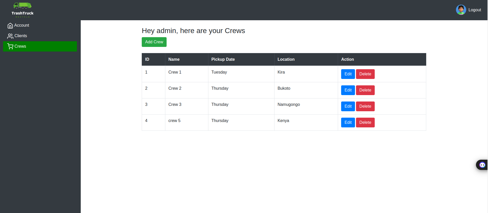

# TrashTruck UG - Waste Management System

## Table of content

- [The Story](#the-story)
- [Getting Started](#getting-started)
- [Screenshots](#screenshots)
- [Features](#features)
    - [Auth](#auth)
- [Built With](#built-with)
- [Authors](#authors)
    - [Rino Kitimbo](#rino-kitimbo)
    - [Peter Lubega](#Peter-Lubega)
    - [Andrew Ssentongo](#andrew-ssentongo)
- [Acknowledgments](#acknowledgements)

## The story

## Introduction
Welcome to TrashTruck UG, a user-friendly waste management system designed by a team of passionate ALX-SE students. The system aims at tackling the pressing issue of waste management especially in Uganda by providing a digital solution that can be adopted by waste management companies to connect to their clients in an efficient and eco-friendly way.

## Problem
Imagine a Uganda where waste management is almost no longer a headache due to poor waste disposal, where communities are cleaner, and people live healthier lives. Unfortunately, that's not the reality for many Ugandans[1][Poor waste management in Kampala, Uganda]. Poor waste disposal practices lead to environmental pollution[2][implications of poor waste management in Uganda], causing diseases that could be easily avoided. Many waste management companies struggle to reach their clients effectively due to outdated systems and limited digital presence.

## Solution
TrashTruck UG will bridges the gap between waste management company and the community. With our system, the company can communicate better with its clients, plan and do waste collection efficiently thus contributing to keeping our communities clean and safe. This project is built using the Flask framework owing to its simplicity, flexibility, and scalability.

A Kanban board on Trello was utilized throughout in order to keep tasks and communication organized.
The HTML Ginger front end and the way routing was designed, allowed TrashTruck to have more dynamic features without handcuffing the rest of the project.
A REST API allowed for this frontend to interact with out backend in a simple and well documented way.
We decided to use ORM (SQLAlchemy) and PostgreSQL because of modularity and familiarity.

Front End
* HTML Jinja templating engine
* Bootstrap for consistent styling
* API calls to manipulate database

REST API
* GET, POST, PUT requests handled
* CRUD manipulation through FLASK REST API

Relational Database
* Handled with ORM (SQLAlchemy)
* Model system with base model handling identification
* Many to many relationship for users and crews

## Features

**User-Friendly Interface:** Our system provides a seamless experience for both waste management companies and clients.

**Secure Authentication:** User passwords are hashed for security, ensuring data protection.

**Personalized Profiles:** Clients can update their profiles with preferences for waste collection schedules and types.

**Admin Dashboard:** Admins have access to a comprehensive dashboard for managing users, crews, and client information.

**Efficient Crew Management:** Admins can add, edit, and delete waste collection crews with ease.

**Interactive Client Management:** Admins can view and manage client details, ensuring smooth operations.

## Getting Started

To get started with TrashTruck UG, follow these simple steps:

1. **Clone the Repository:**

git clone https://github.com/your-username/trashtruck-ug.git

cd trashtruck-ug

2. **Set Up Environment:**

python3 -m venv venv

source venv/bin/activate

pip install -r requirements.txt

3. **Configure Database:**

Update the database URI in `config.py` to your preferred database setup.

4. **Run the Application:**

python3 app.py

5. **Access the Application:**

Open a web browser and go to http://127.0.0.1:5000 to access TrashTruck UG.

Admin credentials:
email: admin@gmail.com
password: admin1234

##Project Structure

#@TrashTruck-ALX-portfolio-project/
#@├── app.py
#@├── config.py
#@├── __init__.py
#@├── models.py
#@├── README.md
#@├── requirements.txt
#@├── app.py
#@├── static/
#@│   ├── css/
#@│   │   ├── dashLayout.css
#@│   │   └── forms.css
#@│   └── images/
#@│       ├── avatar.jpg
#@│       ├── black.jpeg
#@│       ├── blue.jpeg
#@│       ├── green.jpeg
#@│       ├── login.jpg
#@│       ├── logo.png
#@│       └── register.jpg
#@├── templates/
#@│   ├── 404.html
#@│   ├── 500.html
#@│   ├── base.html
#@|   ├── clients.html
#@│   ├── crews.html
#@│   ├── home.html
#@│   ├── index.html
#@│   ├── login.html
#@│   ├── profile.html
#@│   └── register.html
#@└── venv/
#@    ├── bin/
#@    │   ├── python -> python3
#@    │   └── python3 -> /usr/bin/python3
#@    ├── include/
#@    ├── lib/
#@    │   └── python3.8/
#@    │       └── site-packages/
#@    ├── lib64 -> lib
#@    └── pyvenv.cfg

## Built With
* [Python](http://www.python.org) - The Backend Language
* [Javascript](https://developer.mozilla.org/en-US/docs/Web/JavaScript) - The Frontend Language
* [Flask](http://flask.pocoo.org/docs/1.0/) - The Web Development Framework
* [SQLAlchemy](https://www.sqlalchemy.org/) - Python SQL Toolkit and Object Relational Mapper
* [PostGresSQL](https://www.postgresql.org/) - Relational Database Management System
* [HTML Ginger templating engine](https://hackage.haskell.org/package/ginger-0.10.5.2/docs/Text-Ginger.html) - HTML

## Routes and Views

- **Landing Page:** `/` - Renders the home page.

- **User Login:** `/login` - Handles user login and authentication.

- **User Registration:** `/register` - Handles user registration and account creation.

- **User Profile:** `/user/<name>` - Displays user profile information and allows editing.

- **Edit Profile:** `/edit_profile/<int:id>` - Handles editing of user profile information.

- **Admin Dashboard:** `/dashboard` - Displays the admin dashboard for managing users and crews.
- **Clients:** `/clients` - Displays client information and allows admin actions.

- **Crews:** `/crews` - Displays crew information and allows admin actions.

- **Add Crew:** `/add_crew` - Handles adding new crews to the system.

- **Edit Crew:** `/edit_crew/<int:id>` - Handles editing existing crew information.

- **Delete Crew:** `/delete_crew/<int:id>` - Handles deleting crews from the system.

## Example Use Cases

 **User Registration:**

- Sign up as a new user and provide your details (e.g., name, email, password).

- Customize your profile settings, including waste pickup preferences.

 **User Login:**

- Log in with your registered email and password to access your account.

- Explore the dashboard and manage your waste collection preferences.

 **Admin Dashboard:**

- Access the admin dashboard with administrative privileges.

- Manage crews, clients, and informed decision-making.

## Other resources.
### **Blog link**

https://medium.com/@peterlubega100/trashtruck-waste-management-system-0dad7fbe2248

[1]: https://www.monitor.co.ug/uganda/oped/letters/poor-waste-disposal-and-management-is-a-threat-to-health-and-the-environment-4584430

[2]: https://www.monitor.co.ug/uganda/oped/letters/implications-of-poor-waste-management-on-water-quality-and-public-health-4274644

## Contributor Team

TrashTruck is created by a dedicated team of ALX-SE students:

### **Rino Kitimbo**
[rinokitimbo](https://kredinc.vercel.app/)

Rino is a frontend software engineer, working on the UI/UX design, frontend, and Application architecture.

### **Peter Lubega**
    

Peter is a full stack software engineer who enjoys both backend work, taking charge of the database and flask portions of TrashTruck while still being heavily involved in the API work as well.

### **Andrew Ssentongo**
    

Andrew is a backend stack software engineer who loves the backend, taking charge of the flask parts of TrashTruck.
    
If you would like to contact [Rino](https://kredinc.vercel.app/) or [Peter] or [Andrew] about any opportunities, feel free to reach out!

## Acknowledgements
* [ALX](https://www.alx.com/) (Staff and Students)

--------------------------------------------------------------------------------------------
Thank you for choosing TrashTruck. Together, we can make Uganda cleaner and healthier
